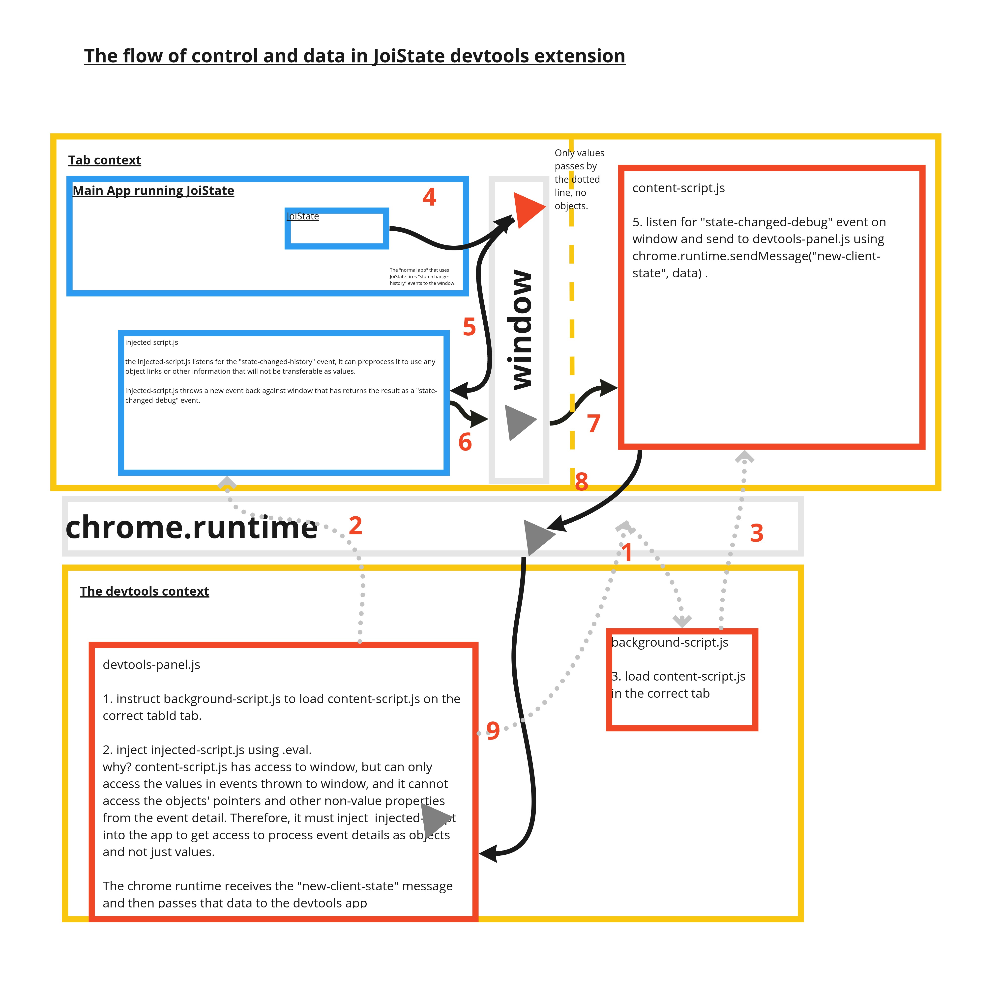

### How to install
1) In chrome, open [chrome://extensions](chrome://extensions)
2) Make sure "developer mode" is selected.
3) Select _Load unpacked  extension..._ and 
   choose the folder in which devtools-page.js is located.
4) You must close and reopen the dev tools window to see the plugin.

### How to make changes
When you have made changes in the folder from where you
installed the extension, you can simply close and reopen the devtools.

### How does it work?

#### How to debug: content-script.js
1) Open the __normal__ devtools (F12) from an app that uses JoiState.
2) Select __sources__ panel
3) Select __content scripts__ above the list of files.
  
### the relationship between injected-script.js and content-script.js
The main purpose of injected-script.js is to JSON.stringify 
the value of the "state-get-history" event.
The main purpose of content-script.js is to listen for events
on the window and send a message to the devtools-panel.js via 
chrome.runtime.sendMessage.

But why do we need both of these files, why cannot content-script
(or injected-script.js) do both?

The reason for this is: 
a) injected-script cannot access chrome.runtime.
b) content-script can only read primitive values from the event
it listens to on window.

#####Too short, did not understand:
Both injected scripts and content scripts can listen for event
on the window object in the tab. But(!) content scripts can 
only read primitive values as the event detail of these events - 
content scripts cannot read the event detail from window if these 
details are an object. Injected scripts, on the other hand, can read 
complex objects in the event detail of events listen to on window. However,
injected scripts cannot use chrome.runtime.sendMessage.

To bypass these restrictions, the injected script reads the event, JSON.stringifies 
the event detail and then send a new event with more or less the same data, but 
with a different event name and only a string (with the JSON data) as the event detail
back to the window. Then, the content-script can listen for this second event, and
see more or less the same data as a JSON string, and then the content-script can send
that data back to the devtools-panel.js.

##### injected-script.js and previous historical events.
At startup, the injected-script also triggers the JoiState to send its history.
The injected-script will also read all the events of the history and pass them along
if it is the first time it runs.
 
##### How to debug injected-script.js?
1) Open the __normal__ devtools (F12) from an app that uses JoiState.
2) Select __console__ panel (!!This is weird trick!!) 
3) Click on the link to right of the console.info message saying:
"To debug the injected script StatePrinter, click here!"
  
#### How to debug: devtools.panel.js, app.js and all other js files
1) Open the __normal__ devtools (F12) from an app that uses JoiState.
2) Select __polyState__ panel.
3) __Rightclick__ anywhere on the panel
4) Choose __inspect__. This will open __devtools of devtools__.
5) In __devtools of devtools__, select __sources__
6) In the file selector, choose __devtools-panel.html__
7) Here you will find devtools.panel.js, app.js and all other js files.
                                            